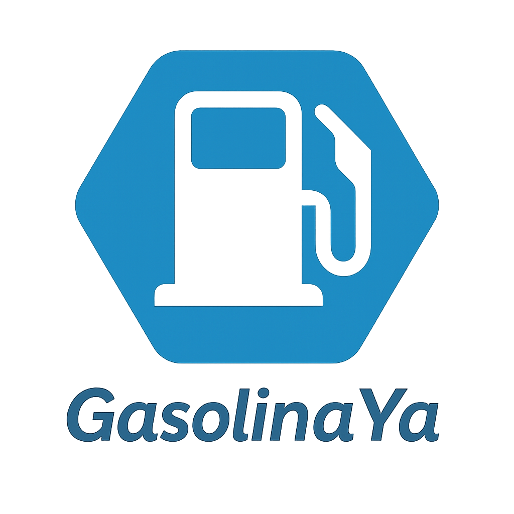

# GasolinaYa - Sistema de Gestión de Estaciones de Gasolina

<p align="center">
  
</p>

Este proyecto es una aplicación desarrollada con React + TypeScript y construida con Vite. Proporciona un sistema integral para la gestión de estaciones de gasolina, reservas y reportes. La aplicación incluye funcionalidades tanto para administradores como para clientes.

---

## Uso de `db.json`

El proyecto utiliza `json-server` para simular un backend con el archivo `db.json`. Este archivo contiene datos estructurados como usuarios, estaciones de gasolina, tickets, zonas, tipos de combustible, estados de tickets y notificaciones.

### Estructura de `db.json`

- **`users`**: Contiene información de usuarios, incluyendo roles (`admin` o `client`).
- **`customers`**: Relaciona usuarios con información adicional como número de identificación y autos registrados.
- **`gasStations`**: Información de estaciones de gasolina, como zona, servicios y horarios.
- **`tickets`**: Registros de reservas de combustible, incluyendo estado, tipo de combustible y cantidad.
- **`notifications`**: Notificaciones enviadas a los usuarios.
- **`zones`**, **`gasTypes`**, **`ticketStates`**: Datos auxiliares para zonas, tipos de combustible y estados de tickets.

### Ejecución de `json-server`

1. Instala `json-server` globalmente si no lo tienes instalado:
   ```bash
   npm install -g json-server
   ```

2. Ejecuta el servidor:
   ```bash
   json-server --watch db.json --port 3000
   ```

3. El servidor estará disponible en:
   ```
   http://localhost:3000
   ```

---

## Análisis y Reportes

### Registro de Análisis

Los administradores tienen acceso a un módulo de análisis donde pueden visualizar reportes detallados sobre el uso de las estaciones de gasolina. Este módulo incluye:

- **Gráficos**: Se utilizan las librerías `chart.js` y `chart.js2` para generar gráficos interactivos que muestran datos como consumo de combustible, horas pico y estados de tickets.
- **Generación de PDF**: Se utiliza `pdfjs` para generar reportes en formato PDF que los administradores pueden descargar.
- **Filtrado**: Los datos pueden ser filtrados por **rango de tiempo** y **estación de gasolina**, permitiendo un análisis más específico.

### Acceso

El módulo de análisis es visible únicamente para usuarios con rol de administrador después de iniciar sesión.

---

## Custom Hooks

### `useLogin`
Maneja la funcionalidad de inicio de sesión, incluyendo validación de formularios, llamadas a la API y manejo de errores.

### `useStationAdmin`
Administra las operaciones CRUD para estaciones de gasolina, incluyendo la obtención, creación, actualización y eliminación de estaciones.

### `useReports`
Obtiene y administra datos de tickets para generar reportes.

### `useFilterByStation`
Filtra tickets por estación de gasolina, tipo de combustible y rango de fechas para propósitos de reportes.

### `useFilterByRushHours`
Analiza los datos de tickets para determinar las horas pico de actividad.

### `useNotifierNavBar`
Maneja las notificaciones en la barra de navegación, incluyendo notificaciones no leídas y su archivado.

### `useGasStations`
Filtra estaciones de gasolina por zona y maneja la selección de estaciones para reservas.

### `useReservationStore`
Administra las reservas realizadas por los usuarios.

### `useBooking`
Maneja la lógica relacionada con las reservas, incluyendo la obtención de reservas y la cancelación de las mismas.

---

## Uso de Librerías

### Formik + Yup
Se utiliza Formik para manejar formularios y Yup para la validación de datos. Esto se aplica en formularios como el de inicio de sesión (`LoginPage`) y el de reservas (`BookingForm`).

### Material-UI (MUI)
Material-UI se utiliza ampliamente en el proyecto para construir una interfaz de usuario moderna y responsiva. Los componentes destacados incluyen:
- **Dialogs**: Para confirmaciones y formularios modales, como en `StockManagementModal` y `EnTurnoModal`.
- **Snackbars**: Para mostrar mensajes de retroalimentación al usuario, como confirmaciones de acciones exitosas o errores.
- **Icons**: Se utilizan íconos de MUI para mejorar la experiencia visual, como en botones de acción (`Edit`, `Delete`, `Add`).
- **Dropdowns**: Menús desplegables para seleccionar opciones, como zonas o tipos de combustible.
- **TextFields**: Campos de entrada para formularios, con validación integrada.
- **Buttons**: Botones estilizados para acciones como guardar, cancelar o filtrar.
- **Tables**: Tablas para mostrar datos como tickets y estaciones de gasolina, con soporte para paginación y ordenamiento.

### Notistack
Se utiliza `notistack` para manejar notificaciones en forma de snackbars apilables. Permite mostrar hasta 5 notificaciones simultáneamente en la interfaz, mejorando la experiencia del usuario.

### Chart.js y Chart.js2
Se utilizan para generar gráficos interactivos en el módulo de análisis.

### PDF.js
Se utiliza para generar reportes en formato PDF en el módulo de análisis.

---

## Gestión de Estado con Zustand

El proyecto utiliza `Zustand` para la gestión de estado global, permitiendo compartir datos entre componentes de manera eficiente. Algunos ejemplos de uso incluyen:
- **Datos del Usuario**: Almacenar y compartir información del usuario autenticado, como su rol (`admin` o `client`), nombre y correo electrónico.
- **Reservas**: Manejar el estado de las reservas realizadas por los clientes.
- **Estaciones de Gasolina**: Almacenar y filtrar datos de estaciones de gasolina según las preferencias del usuario.
- **Notificaciones**: Gestionar notificaciones en tiempo real, incluyendo su estado de lectura.

---

## Api Context para Usuarios Clientes

El proyecto utiliza un `Api Context` para manejar las interacciones con la API en la parte de usuarios clientes. Esto incluye:
- **Reservas**: Crear, actualizar y cancelar reservas.
- **Datos del Cliente**: Obtener información adicional del cliente, como autos registrados y número de identificación.

El `Api Context` centraliza las llamadas a la API, simplificando la lógica en los componentes y mejorando la mantenibilidad del código.

---

## Filtrado en la Interfaz de Administrador y Usuario

### Filtrado de Tickets
En la interfaz de administrador se puede filtrar tickets por:
- **Nombre del ticket**: Nombre de gasolinera.
- **Tipo de combustible**: Especial, Diesel, GNV, etc.
- **Zonas**: Para ver la zona donde se encuentra el gas station.
- **Disponibilidad**: Para ver los que tienen disponibilidad de combustible.

### Filtrado de Estaciones de Gasolina
Los usuarios pueden filtrar estaciones de gasolina por **Zona** (Centro, Sur, Mallasa, etc.).

### Filtrado de Análisis de Datos
En el módulo de análisis, los administradores pueden filtrar los datos por:
- **Rango de tiempo**: Permite seleccionar un período específico para analizar datos históricos.
- **Estación de gasolina**: Filtra los datos relacionados con una estación específica.

Ambos filtros están diseñados para ser intuitivos y rápidos, mejorando la navegación y la experiencia del usuario.

---

## Instalación y Ejecución

1. Clona el repositorio:
   ```bash
   git clone <repository-url>
   cd SubvencionaII
   ```

2. Instala las dependencias:
   ```bash
   npm install
   ```

3. Instala `notistack`:
   ```bash
   npm install notistack
   ```

4. Crea un archivo `.env` con la URL del backend:
   ```dotenv
   VITE_API_URL=http://localhost:3000
   ```

5. Inicia el servidor JSON:
   ```bash
   json-server --watch db.json --port 3000
   ```

6. Inicia el servidor de desarrollo:
   ```bash
   npm run dev
   ```

7. Abre tu navegador y navega a:
   ```
   http://localhost:5173
   ```

---

## Comandos

- **`npm run dev`**: Inicia el servidor de desarrollo.
- **`npm run build`**: Construye la aplicación para producción.
- **`npm run preview`**: Previsualiza la construcción de producción.

---
